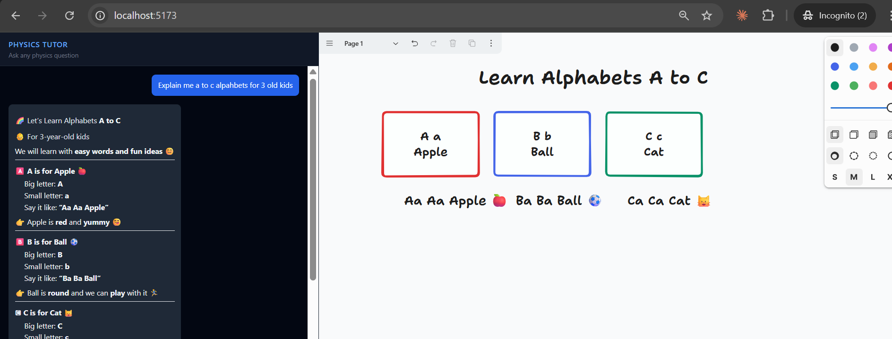
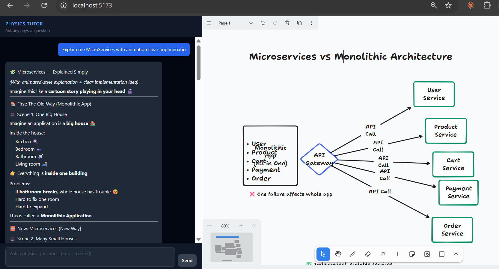
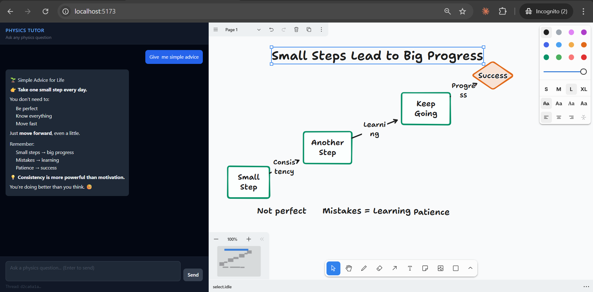

# AI Tutor with Live Whiteboard

An AI tutoring application that answers any question with both a **written explanation** and an **auto-generated diagram** on an interactive whiteboard — at the same time.

Ask about physics, math, biology, history, computer science — the AI explains it in the chat and draws a visual on the canvas to go with it.

---

## What It Does

You type a question. Two things happen:

1. **The tutor explains it** — a clear, structured answer with the right level of detail, rendered as formatted text in the chat panel.
2. **The canvas draws it** — a diagram automatically appears on the whiteboard with shapes, arrows, and labels that visually illustrate the concept.

The whiteboard is fully interactive — you can move, resize, annotate, and draw on top of whatever the AI generates.

Conversation history is remembered across sessions, so you can have a continuous back-and-forth on a topic without losing context.

---

## Key Features

- **Dual-output AI** — every response produces both a written explanation and a whiteboard diagram, generated by two AI agents working in sequence
- **Works on any topic** — not limited to one subject; the AI adapts its explanation and diagram style to whatever you ask
- **Interactive whiteboard** — AI-drawn shapes are just a starting point; the canvas is fully editable
- **Persistent conversations** — sessions are saved so you can pick up where you left off
- **Streaming responses** — explanations arrive in real time as the AI generates them
- **Cancellable** — stop a response mid-generation with one click
- **Markdown rendering** — formulas, headers, bullet points, code blocks all render properly

---

## How It Works (High Level)

```
Your question
      │
      ▼
 ┌─────────────┐     ┌──────────────────┐
 │  Tutor AI   │────▶│  Illustrator AI  │
 │  (explains) │     │  (draws diagram) │
 └─────────────┘     └──────────────────┘
      │                       │
      ▼                       ▼
  Chat panel            Whiteboard canvas
  (Markdown)            (Shapes + arrows)
```

Two AI agents run in a pipeline for every message:
- The **Tutor** crafts a clear, intuition-first explanation
- The **Illustrator** reads that explanation and generates whiteboard commands — shapes, arrows, labels — that visually complement what was said

---

## Setup

### Prerequisites

- Node.js 18+
- An Azure OpenAI resource with a deployment
- A MongoDB Atlas cluster

### Backend

```bash
cd backend
cp .env.example .env
# Fill in your Azure OpenAI and MongoDB credentials
npm install
npm run dev
```

### Frontend

```bash
cd frontend
cp .env.example .env
# Set VITE_API_URL if your backend is not on localhost:3001
npm install
npm run dev
```

Open `http://localhost:5173`.

### Environment Variables

**Backend `.env`**

| Variable | Description |
|---|---|
| `AZURE_OPENAI_API_KEY` | Your Azure OpenAI API key |
| `AZURE_OPENAI_API_INSTANCE_NAME` | Azure resource instance name |
| `AZURE_OPENAI_API_DEPLOYMENT_NAME` | Model deployment name |
| `AZURE_OPENAI_API_VERSION` | API version (default: `2025-04-01-preview`) |
| `MONGODB_URI` | MongoDB Atlas connection string |

**Frontend `.env`**

| Variable | Description |
|---|---|
| `VITE_API_URL` | Backend URL (default: `http://localhost:3001`) |

---

## Project Structure

```
├── backend/
│   └── src/
│       ├── agents/       # Tutor and Illustrator AI agent definitions
│       ├── graph/        # LangGraph pipeline (state, nodes, graph)
│       ├── routes/       # REST API endpoints
│       ├── db/           # MongoDB connection and session persistence
│       └── server.ts     # Express entry point
└── frontend/
    └── src/
        ├── components/   # Layout, ChatPanel, Whiteboard canvas
        ├── hooks/        # Canvas action executor, stream parser
        └── types/        # Shared TypeScript types
```

---

## Tech Stack

| Layer | Technology |
|---|---|
| AI Orchestration | LangGraph.js |
| Language Models | Azure OpenAI |
| Conversation Memory | MongoDB Atlas |
| Backend | Node.js + Express + TypeScript |
| Frontend | React + TypeScript + Vite |
| Whiteboard | tldraw |
| Styling | Tailwind CSS |

---

## Screenshots

**Teaching alphabets to a 3-year-old** — the tutor adapts its language and the canvas draws labelled letter cards



---

**Explaining Microservices vs Monolithic Architecture** — a CS concept with an auto-generated service diagram



---

**Life advice** — not just academic topics; the canvas visualises the idea as a flow



---

## License

MIT
